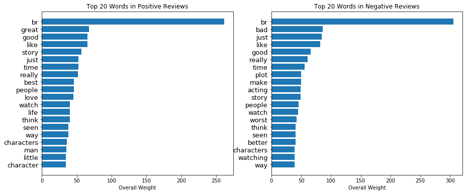
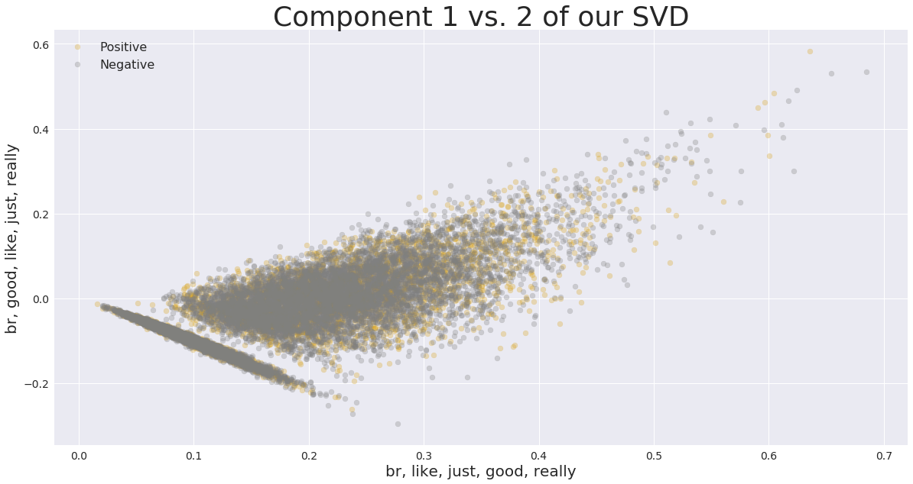
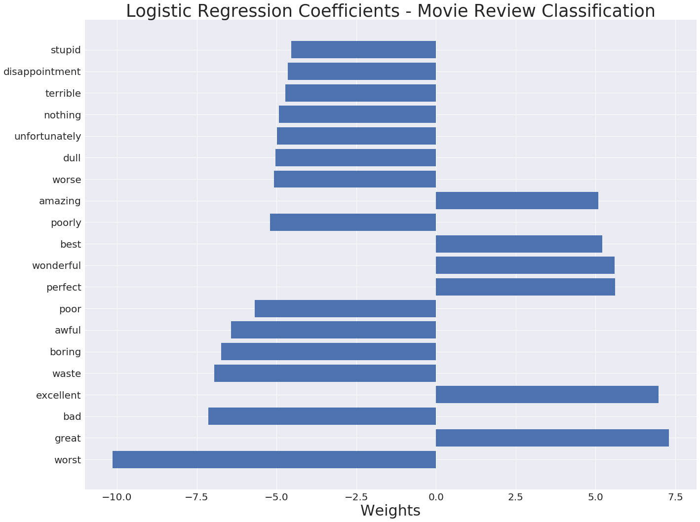

<h1 align="center">Technical Report - Building a Model for Sentiment Analysis</h1>

_James Drabinsky_

---

## Outline

- [Problem statement](#problem-statement)
- [Data Collection](#data-collection)
- [Exploratory Data Analysis](#exploratory-data-analysis)
- [Vectorization and Modeling](#vectorization-and-modeling)
- [Application](#application)
- [Next Steps](#next-steps)

---

## Problem Statement

With the emergence of social media platforms over the past decade consumers have the ability to quickly and easily express their opinions about a movie, tv show, or other type of consumer product.  This endless stream of social media conversation can be viewed as a benefit to companies as it provides them with information about how the product is being received by the consumers.  However, if a company is not able to effectively aggregate and interpret this feedback across multiple social media outlets they lose the advantage that these new technologies might provide, and could potentially be at a disadvantage relative to other companies that are more adept at responding to their customers or audience through social media.

I will build a model that can predict the sentiment of a movie review, social media post and any other type of document.  This model will be trained on a dataset containing movie reviews from IMDB and then applied to a stream of tweets relating to a recently released movie.  If successful, this model will provide companies with vital and up-to-date customer sentiment which they can use in a number of ways, including identifying potential crises, evaluating overall brand health, or tracking reaction to new products or ad campaigns.

---

## Data Collection

I obtained the IMDB movie reviews dataset directly from Kaggle.  The dataset can be found [here](https://www.kaggle.com/utathya/imdb-review-dataset).

I also scraped 5732 (after eliminating duplicates) using the Twython, a Python wrapper for the Twitter API.  That code can be found in this notebook 
<a href="code/06_tweet_scraper.ipynb">tweet scraper notebook</a>

---

## Exploratory Data Analysis

While I did eventually end up building a high-scoring model, a lot of the EDA that I did demonstrated a lot of overlapping features between the positive and negative classes.  The plot below shows the top 20 words as determined by tfidf.  There are a lot of overlapping words which is not unexpected since one can use the same words to describe a movie positively or negatively 

  

This was also evident when doing singular value decomposition.  I had reduced the features from over 60000 to 5000, but there was still a lot of overlapping between pairs of components which meant that many of the same words were categorized in different components.

  

One area where I did find a difference between the positive and negative classes was when looking at the top 20 words and their associated coefficients in a logistic regression model.  It is clear which words belong to which class because all of the words associated with negative reviews have negative weights and all words associated with positive reviews have positive weights.  Also, it seems that the more extreme the words are the higher their weights in both directions.

  

---

## Vectorization and Modeling

My first vectorization technique was using the GloVe pretrained word embedding.  Word embeddings map semantic meaning into a geometric space.  I used a 300-dimensional GloVe embedding of 400k words computed on a 2014 dump of English Wikipedia.  From this word embedding I computed the document embedding by taking the component-wise mean of its component word embeddings.  

Next I used tfidf top generate vectors. Even though tfidf considers the relative frequency or rareness of tokens in a document against their frequency in other documents, it does not account for the semantic relationship between words like a word embedding does.  To address this issue, I decided to use the Doc2Vec vectorization method.  Doc2vec offers an entirely different algorithm than tfidf in that it represents each document by a dense vector which is trained to predict words in the document. Its construction gives the algorithm the potential to overcome the weaknesses of bag-of-words models.  

There are two methods of implementing Doc2Vec: Distributed Memory (DM) and Distributed Bag of Words (DBOW). DM attempts to predict a word given its previous words and paragraph vector. DBOW predicts a random group of words in a paragraph given only its paragraph vector.  I consistently got my best scores with the DBOW model.  

When pairing the Doc2Vec models with classifiers, the two pairings that produced the best scores were Doc2Vec DBOW with logistic regression and Doc2Vec DBOW with gradient boost.  I decided to use the gradient boost classifier in my production model.  I made this decision because gradient boosting is an ensemble technique which means it has many different predictors trying to predict the same target variable, and as a boosting method, it adds one classifier at a time so that the next classifier is trained to improve the already trained ensemble.  Logistic regression is a linear classifier and is not equipped to make the types of decision that gradient boosting does.  

| Model                          | Score
|------------------------------  |---------------
| Gradient Boost w Doc2Vec       | 0.87 
| LogReg w TFIDF and SVD         | 0.89      
| Logistic Regression w Doc2Vec  | 0.88

---

## Application

This notebook <a href="code/07_Application_of_Model.ipynb">application notebook</a> is a demonstration of how to apply the sentiment analysis model I have built.  I have imported 5732 tweets from the past week, all containing the hashtag #FirstMan (in reference to a movie that was recently released).  The tweets will be processed as follows:

- They will be concatenated to the original movie review dataframe on the 'review' column
- They will be preprocessed by the review_cleaner function 
- Doc2Vec will train its models on the entire new corpus (movie reviews + tweets) in order to build a new vector space
- A gradient boost classifier will then train on these new vectors and will output a value of 'positive' or 'negative' when assessing the new tweets 

I applied my model to the tweets and compared the output to that of TextBlob and Vader Sentiment.  Here are the results:

| Tool             | positive 	| negative | neutral  | 
|----------------- |-----------	|--------  |----------|
| my_model  	   | 4816      	| 916      | XXX      | 
| textblob     	   | 3715      	| 717      | 1300     | 
| vader_sentiment  | 3321      	| 1007     | 1404     |     

---

## Next Steps

- Build a more granular model that can predict values other than just positive or negative.  This would require training a model on a much more detailed dataset with a range of sentiments used to describe documents.

- Find a more effective way to incorporate pretrained word embeddings into the vectorization process.  The scores I got when using the GloVe embedding were lower than the scores I got with doc2Vec and tfidf, so I don't think I was employing it in the best way.

- Try using Sent2Vec, Tweet2Vec and other unsupervised approaches towards learning sentence embeddings.
